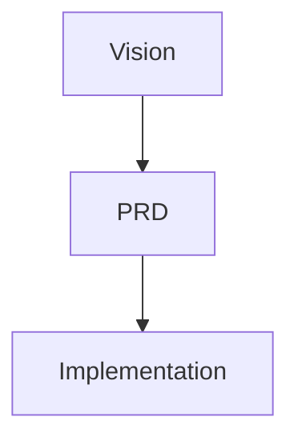

# 📐 Documentation Style Guide

> **Project:** Mock:ctl
>
> **Document ID:** PKS-002
>
> **Version:** 1.0
>
> **Status:** Approved
>
> **Owner:** Upen Tudu
>
> **Authors:** Upen Tudu & ChatGPT
>
> **Created:** 2026-08-06
>
> **Last Updated:** 2026-08-06
>
> **Category:** Foundation
>
> **Priority:** Critical

---

# 📖 Overview

This document defines the official documentation standards for the Mock:ctl Project Knowledge System (PKS).

Every document within the project must follow this guide to ensure consistency, readability, maintainability, and compatibility with both human readers and AI coding agents.

This guide establishes the standard structure, formatting, writing style, naming conventions, versioning strategy, and documentation rules used throughout the project.

---

# 🎯 Purpose

The objectives of this document are to:

- Standardize every project document.
- Improve readability.
- Maintain consistency across the PKS.
- Reduce ambiguity.
- Improve AI-assisted development.
- Simplify long-term maintenance.

---

# 📌 Scope

This guide applies to every document inside the Project Knowledge System, including:

- Foundation Documents
- Product Documents
- Engineering Documents
- AI Documentation
- Architecture Decision Records (ADRs)
- Technical Specifications
- Future Documentation

---

# 🏛 Documentation Principles

Every document must follow these principles.

## 1. Consistency

All documents should follow the same structure and formatting.

---

## 2. Simplicity

Write documentation that is easy to understand.

Avoid unnecessary complexity.

---

## 3. Precision

Documentation should be specific.

Avoid ambiguous words such as:

- maybe
- probably
- somehow
- possibly

Prefer clear and measurable statements.

---

## 4. Readability

Use:

- Short paragraphs
- Clear headings
- Bullet lists
- Tables where appropriate

Large blocks of text should be avoided.

---

## 5. Single Source of Truth

Every piece of information should exist in one authoritative location.

Other documents should reference that location instead of duplicating content.

---

# 📝 Standard Document Structure

Unless a document has a justified exception, it should follow this structure.

1. Metadata
2. Overview
3. Purpose
4. Scope
5. Main Content
6. Engineering Notes
7. Related Documents
8. Revision History
9. Approval Checklist

---

# 📋 Metadata Format

Every document begins with the following metadata.

```text
Project:
Document ID:
Version:
Status:
Owner:
Authors:
Created:
Last Updated:
Category:
Priority:
```

---

# 🔠 Heading Hierarchy

Use only the following heading levels.

```markdown
# Document Title

## Major Section

### Subsection

#### Detail
```

Avoid heading levels deeper than four.

---

# ✍️ Writing Style

Documentation should be:

- Professional
- Objective
- Concise
- Clear
- Direct

Avoid:

- Marketing language
- Personal opinions
- Informal expressions
- Unnecessary repetition

---

# 🌍 Language Standard

All official project documentation must be written in English.

Reasons:

- Industry standard
- Better collaboration
- Better AI understanding
- Better compatibility with development tools

---

# 📚 Terminology

Use consistent terminology.

| Preferred | Avoid |
|-----------|-------|
| Repository | Repo |
| Directory | Folder |
| Documentation | Docs |
| Requirement | Need |
| Implementation | Coding |
| Application | App (formal documents) |

---

# 📂 Lists

Use unordered lists for collections.

Example:

```text
- Authentication
- Authorization
- Validation
```

Use numbered lists only when sequence matters.

---

# 📊 Tables

Use tables whenever information is easier to compare.

Example:

| Component | Responsibility |
|-----------|----------------|
| API | Business Logic |
| Database | Persistent Storage |

---

# 💻 Code Blocks

Always specify the language.

Example:

```typescript
const app = new Hono();
```

Never leave the language unspecified.

---

# 🗂 File Naming Convention

Documentation files use Pascal Case.

Examples:

```text
Vision.md
PRD.md
Architecture.md
Repository-Blueprint.md
Coding-Standards.md
```

Directories use lowercase.

Examples:

```text
packages/
services/
docs/
```

---

# 📈 Diagrams

Mermaid is the standard diagram language.

Example:



Avoid image-based diagrams unless necessary.

---

# 💡 Notes

Use blockquotes for important notes.

Example:

> **Note**
>
> Documentation should always be updated before implementation.

Avoid excessive warnings and unnecessary callouts.

---

# 🔗 Cross References

Every document must include a **Related Documents** section.

Example:

- PKS-000 — Repository Blueprint
- PKS-001 — Documentation Philosophy
- PKS-010 — Vision

Do not duplicate information between documents.

Reference the authoritative source instead.

---

# 📜 Versioning

Version format:

```text
1.0
1.1
1.2
2.0
```

Version rules:

- Major versions indicate structural or architectural changes.
- Minor versions indicate clarifications, corrections, or improvements.

---

# 📦 Document Status

Allowed values:

```text
Draft
In Review
Approved
Deprecated
Archived
```

Foundation documents are released as **Approved**.

---

# 📌 Engineering Notes

Every document must include an **Engineering Notes** section.

Engineering Notes should explain:

- Why a decision was made.
- Design considerations.
- Future implications.

Do not repeat information already explained elsewhere.

---

# 🤖 AI Compatibility

Documentation should enable AI coding agents to:

- Understand project structure.
- Locate requirements.
- Follow engineering constraints.
- Avoid assumptions.
- Produce consistent implementations.

Every document should provide enough context to minimize prompt complexity.

---

# 🚫 Documentation Anti-Patterns

Avoid:

- Duplicate information
- Undefined abbreviations
- Empty sections
- Broken references
- Inconsistent terminology
- Inconsistent formatting
- Long unstructured paragraphs

---

# 📏 Quality Checklist

Every document must satisfy the following before approval.

- Purpose defined
- Scope defined
- Standard structure followed
- Consistent terminology
- Consistent formatting
- Engineering Notes included
- Related Documents included
- Revision History updated
- Approval Checklist completed

---

# 🔗 Related Documents

**Previous Document**

- PKS-001 — Documentation Philosophy

**Next Document**

- PKS-003 — Project Knowledge System

**Related Documents**

- PKS-000 — Repository Blueprint
- PKS-010 — Vision
- PKS-011 — Product Requirements Document
- PKS-025 — Software Design Document (Master SDD)

---

# 📜 Revision History

| Version | Date | Description |
|----------|------------|---------------------------|
| 1.0 | 2026-08-06 | Initial approved release |

---

# ✅ Approval Checklist

- Documentation structure standardized
- Metadata format defined
- Writing style defined
- Versioning defined
- Naming conventions defined
- AI compatibility guidelines included
- Documentation anti-patterns documented
- Quality checklist completed
- Cross references added

---

**Document Status:** ✅ Approved

**Version:** 1.0

**Review Status:** Completed

**Next Document:** PKS-003 — Project Knowledge System